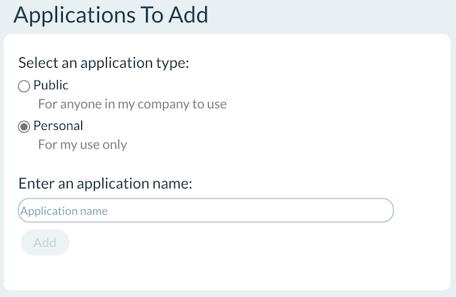

# VersionOne (V1) scripts

The scripts in this repository access VersionOne (now known as [Digital.ai Agility](https://digital.ai/agility).)

To access V1 you will need to know your VersionOne endpoint and create an access token.

See [here](https://versionone.github.io/api-docs/#baseUrl) to learn how to get the endpoint (base URL). 

To create an access token:

1. From V1, click your profile icon in the upper-right-hand corner and select "Applications".
You will see a prompt like the following:<p>

1. Select "Personal", enter an application name like "ScriptAccess" and click "Add".
1. You will be shown an access token along with a message notifying you that
you will not be able to copy it again once the window is closed. Click "Copy to Clipboard"
and put the token in a safe place. 
1. Set the V1 endpoint and token as appropriate for your script.
The endpoint will be the hostname and the first portion of the path you use
when running V1 in your browser.

   For Unix-based systems:
   ```
   export VERSION_ONE_ENDPOINT=https://[host]/[path]
   export VERSION_ONE_TOKEN=[my token]
   ```

   For Windows:
    
   ```
   VERSION_ONE_ENDPOINT=https://[host]/[path]
   VERSION_ONE_TOKEN=[my token]
   ```

   The endpoint and token can also be specified on the command line
   with the `--endpoint` and `--token` parameters.